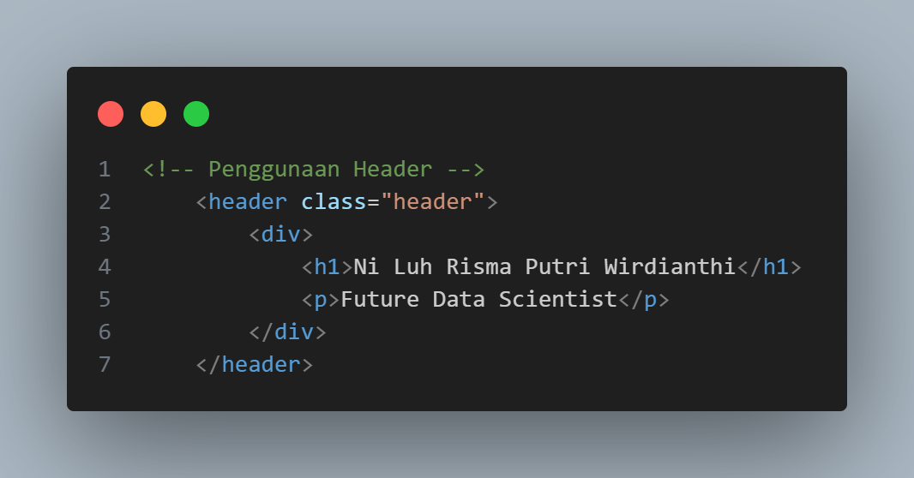
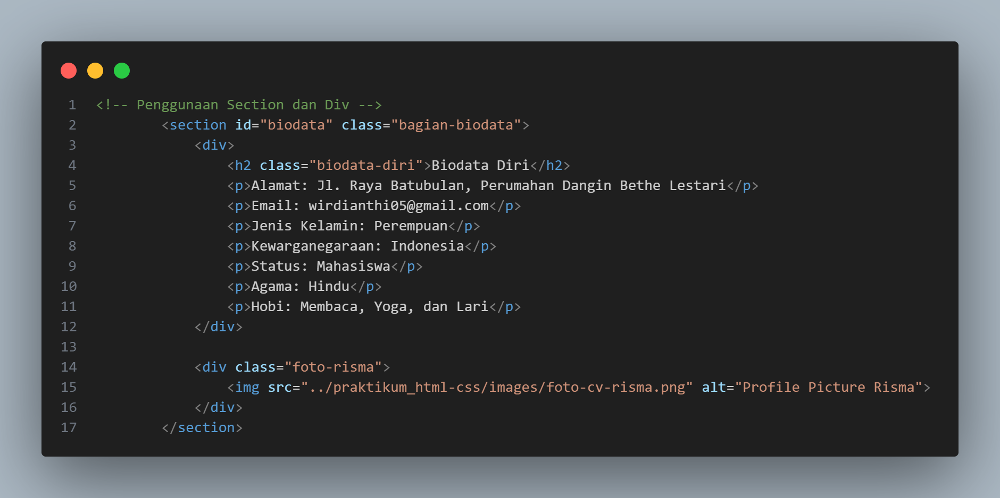
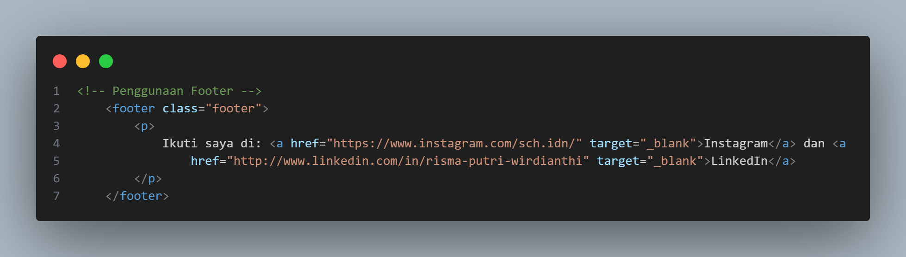
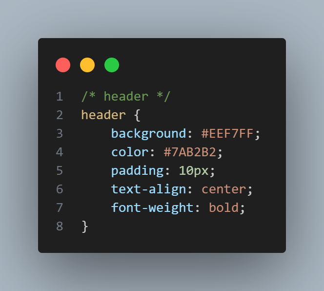
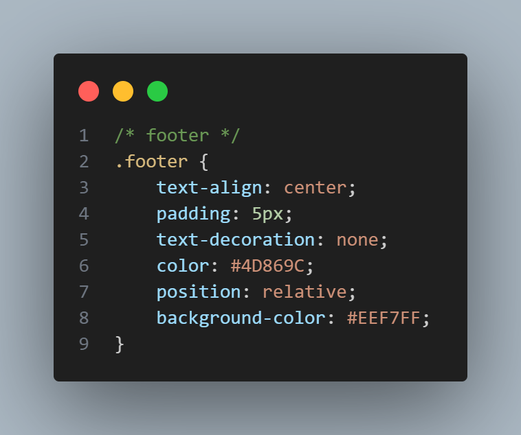
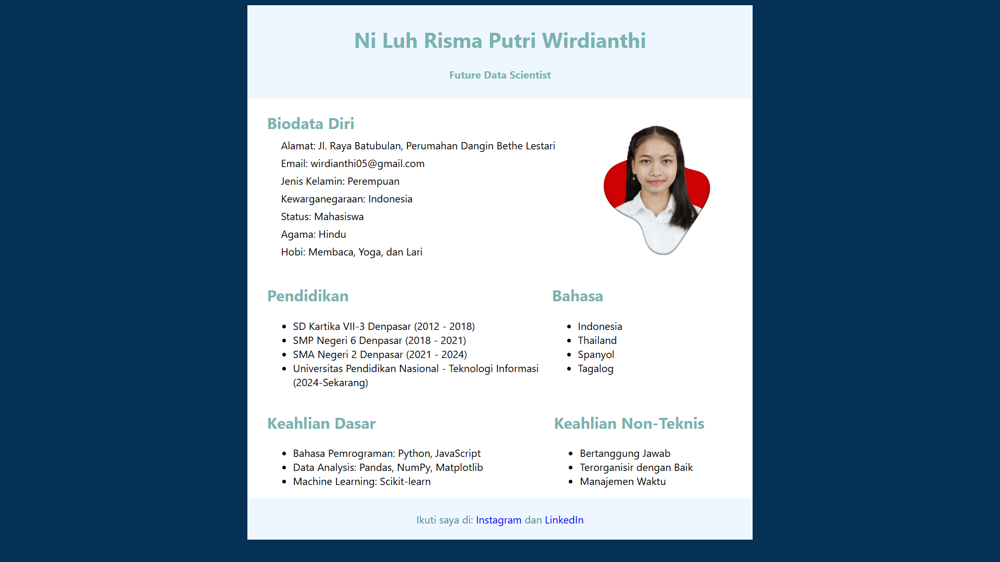

# 📄 CV Digital dengan HTML Semantic dan CSS

Proyek ini adalah pembuatan Curriculum Vitae (CV) sederhana berbasis web.  
Tujuan utama proyek ini adalah melatih penggunaan **HTML semantic** untuk struktur halaman yang rapi dan **CSS** untuk styling agar tampilan lebih menarik dan mudah dibaca.

---

## 📋 Deskripsi
Proyek ini membuat CV sederhana dengan memanfaatkan **HTML semantic** seperti `<header>`, `<section>`, dan `<footer>`.  
CSS digunakan untuk memberikan gaya visual seperti layout, warna, tipografi, dan spasi agar informasi mudah dibaca.

---

## 🧩 Implementasi

Beberapa tag HTML semantic yang digunakan:  
- `<header>` : Menampilkan nama dan posisi (contoh: *Future Data Scientist*).  
- `<section>` : Membagi konten utama seperti pendidikan, pengalaman, dan keahlian.    
- `<footer>` : Bagian penutup CV yang berisi informasi sosial media penulis.  

### Contoh potongan kode: HTML
 
 
 

### Contoh potongan kode: CSS
 
 
 

---

## 🖼 Hasil Tampilan
Berikut ini adalah hasil akhir tampilan CV dalam mode desktop browser: 
 

---

## ✅ Kesimpulan
Proyek ini membantu memahami penggunaan HTML semantic dan CSS dasar dalam membuat halaman CV digital.
Struktur yang rapi memudahkan pengembangan lebih lanjut menjadi CV online yang profesional.
