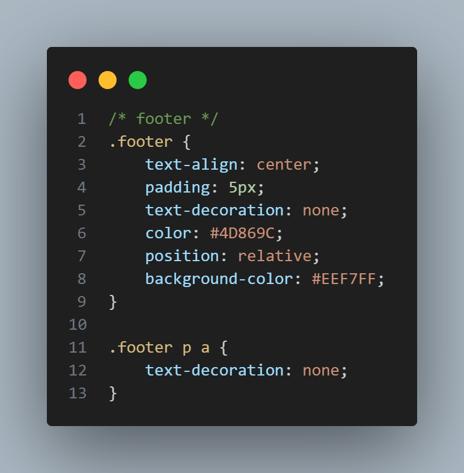

# 📄 CV Digital dengan HTML Semantic dan CSS

Praktikum ini adalah pembuatan Curriculum Vitae (CV) sederhana berbasis web.  
Tujuan utama proyek ini adalah melatih penggunaan **HTML semantic** untuk struktur halaman yang rapi dan **CSS** untuk styling agar tampilan lebih menarik dan mudah dibaca.

---

## 🫧 Identitas Penulis
Nama: Ni Luh Risma Putri Wirdianthi 
NIM: 42430001

---

## 📋 Deskripsi Praktikum
Praktikum ini membuat CV sederhana dengan memanfaatkan **HTML semantic** seperti `<header>`, `<section>`, dan `<footer>`.  
CSS digunakan untuk memberikan gaya visual seperti layout, warna, tipografi, dan spasi agar informasi mudah dibaca.

---

## 🧩 Implementasi

Beberapa tag HTML semantic yang digunakan:  
- `<header>` : Menampilkan nama dan posisi (contoh: *Future Data Scientist*).  
- `<section>` : Membagi konten utama seperti pendidikan, pengalaman, dan keahlian.    
- `<footer>` : Bagian penutup CV yang berisi informasi sosial media penulis.  

### Contoh potongan kode: HTML
 
 
 

### Contoh potongan kode: CSS
 
 
 

---

## 🦾Pembahasan Baris Kode HTML
### Header
 
- `<header class="header">` : Bagian atas halaman untuk identitas utama.  
- `<h1>` : Menampilkan nama pemilik CV.  
- `
` : Menampilkan deskripsi singkat atau posisi, misalnya "Future Data Scientist".  

### Section Biodata
 
- `<section id="biodata" class="bagian-biodata">` : Bagian khusus untuk menampilkan biodata diri.  
- `<h2>` : Judul subbagian "Biodata Diri".  
- `
` : Menampilkan informasi biodata (alamat, email, status, hobi, dll).  
- `
` : Membungkus elemen foto.  
- `` : Menampilkan foto profil agar CV lebih personal.  

### Section Pendidikan dan Bahasa
 
- `<section id="pendidikan-bahasa">` : Bagian untuk menampilkan riwayat pendidikan dan bahasa.  
- `<h2>` : Judul subbagian, yaitu "Pendidikan" dan "Bahasa".  
- `<ul><li>` : Daftar riwayat pendidikan serta bahasa yang dikuasai agar lebih mudah dibaca.  

### Section Keahlian
 
- `<section id="keahlianDasar-nonTeknis">` : Bagian untuk menampilkan keahlian teknis dan non-teknis.  
- `<h2>` : Judul subbagian keahlian.  
- `<ul><li>` : Daftar keahlian teknis (pemrograman, data analysis, machine learning) dan non-teknis (manajemen waktu, tanggung jawab).  

### Footer
 
- `<footer class="footer">` : Bagian bawah halaman.  
- `
` : Menampilkan ajakan untuk mengikuti sosial media.  
- `<a href="..." target="_blank">` : Link menuju Instagram dan LinkedIn yang terbuka di tab baru.  

---

## 🦾Pembahasan Baris Kode CSS
### Body
 

- `font-family: system-ui, 'Segoe UI';` digunakan untuk membuat teks menggunakan font standar sistem agar lebih enak dibaca.  
- `margin-left` dan `margin-right` digunakan untuk memberi jarak kiri dan kanan, jadi isi CV lebih rapi di tengah.  
- `background-color: #053157;` digunakan untuk memberi warna biru gelap sebagai latar belakang halaman.    

### Header
 
    
- `background: #EEF7FF;` digunakan untuk memberi warna latar yang lembut agar kontras dengan background halaman.  
- `color: #7AB2B2;` digunakan untuk mengatur warna teks menjadi hijau kebiruan.  
- `padding: 10px;` digunakan untuk memberi ruang di dalam header agar teks tidak menempel.  
- `text-align: center;` digunakan untuk membuat teks berada di tengah.  
- `font-weight: bold;` digunakan untuk menebalkan teks agar lebih tegas.   

### Section Umum
 

- Semua `<section>` memakai `background-color: white;` supaya isi terlihat bersih di atas background biru.  
- Setiap section utama (`#biodata`, `#pendidikan-bahasa`, `#keahlianDasar-nonTeknis`) diberi `padding-left` agar teks tidak terlalu menempel di tepi.   

### Biodata
<table>
    <tr>
        <td>
             
        </td>
        <td>
             
        </td>
    </tr>
</table>

- `.bagian-biodata` menggunakan `display: flex` agar teks dan foto bisa sejajar.  
- `gap: 50px;` digunakan untuk memberi jarak antara biodata dan foto.  
- `align-items: center;` digunakan untuk membuat konten rata tengah secara vertikal.  
- `line-height: 0.7;` digunakan untuk mengecilkan jarak antarbaris biodata.  
- `flex: 1;` digunakan agar bagian biodata bisa menyesuaikan diri agar tidak tumpang tindih dengan bagian foto.  
- `.bagian-biodata p { text-indent: 21.5px; }` digunakan untuk memberi indentasi di awal tiap paragraf biodata.  
- `.biodata-diri { color: #7AB2B2; }` digunakan untuk membuat judul subbagian tampil dengan warna khusus. 
- `position: relative;` digunakan untuk mengatur posisi gambar agar lebih fleksibel di dalam section. 
- `.foto-risma img { width: 200px; }` digunakan untuk menentukan ukuran foto agar konsisten.  

### Pendidikan dan Bahasa
<table>
    <tr>
        <td>
             
        </td>
        <td>
             
        </td>
    </tr>
</table>

- `#pendidikan-bahasa { display: flex; justify-content: space-between; }` membuat bagian pendidikan dan bahasa ditampilkan berdampingan.  
- `padding-right: 200px;` digunakan untuk memberi ruang di sisi kanan agar tampilan tidak terlalu penuh.  
- `.pendidikan-kuliah { color: #7AB2B2; }` digunakan untuk memberi warna khusus pada judul pendidikan. 
- `width: 45%;` digunakan untuk elemen list agar lebarnya hanya setengah dari container. 
- `.pendidikan-kuliah ul li { text-align: right; }` digunakan untuk membuat daftar pendidikan rata kanan.  
- `.bahasa-digunakan { color: #7AB2B2; }` digunakan untuk memberi warna khusus pada judul bahasa.  
- `.bahasa-digunakan ul li { text-align: left; }` digunakan untuk membuat daftar bahasa rata kiri.  

### Keahlian
<table>
    <tr>
        <td>
             
        </td>
        <td>
             
        </td>
    </tr>
</table>

- `#keahlianDasar-nonTeknis { display: flex; justify-content: space-between; }` digunakan untuk menempatkan keahlian teknis dan non-teknis berdampingan.  
- `.minat-bakat { color: #7AB2B2; }` digunakan untuk memberi warna judul keahlian teknis.  
- `.minat-bakat ul li { text-align: right; }` digunakan untuk membuat daftar keahlian teknis rata kanan.  
- `.bakat-minat { color: #7AB2B2; text-align: left; }` digunakan untuk memberi warna dan meratakan keahlian non-teknis ke kiri. 

### Footer
 
      
- `.footer { text-align: center; padding: 5px; color: #4D869C; background-color: #EEF7FF; }`: Bagian footer dibuat rata tengah, diberi ruang dalam, warna teks hijau kebiruan, dan latar lembut agar kontras dengan halaman.  
- `.footer p a { text-decoration: none; }` digunakan untuk menghilangkan garis bawah pada link, sehingga terlihat lebih bersih.  

---

## 🖼 Hasil Tampilan
Berikut ini adalah hasil akhir tampilan CV dalam mode desktop browser: 
 

---

## ✅ Kesimpulan
Praktikum ini membantu penulis memahami penggunaan HTML semantic dan CSS dasar dalam membuat halaman CV digital.
Struktur yang rapi memudahkan pengembangan lebih lanjut menjadi CV online yang profesional. Sebagai tambahan, penulis juga membuat bagian homepage agar nantinya dimasa depan homepage ini bisa berkembang menjadi portfolio website yang terintegrasi juga dengan CV penulis didalamnya. Sehingga alurnya menjadi: homepage-cv.  
